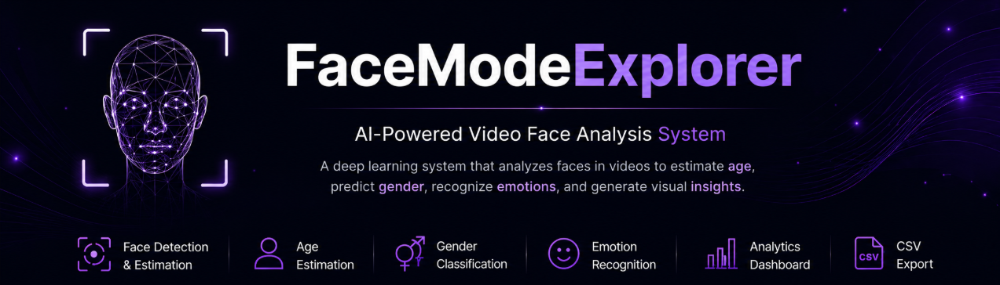

# 

  

<h1 align="center"> FaceModeExplorer</h1>

AI-powered video face analysis system for age estimation, gender classification, and emotion recognition.

## ✨ Key Capabilities

| Face Detection | Age Estimation | Gender Classification | Emotion Recognition | Analytics Dashboard | CSV Export |
|:-------------:|:--------------:|:---------------------:|:-------------------:|:------------------:|:----------:|
| Detect faces in video frames | Estimate age | Predict gender | Recognize facial emotions | Interactive charts & insights | Export predictions |

---

## 🛠 Built With

