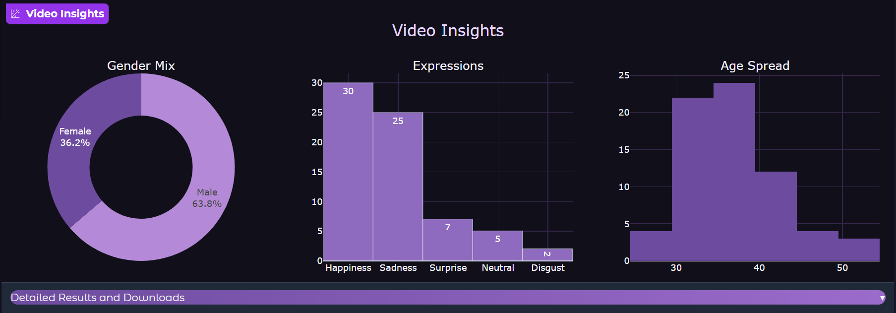

# <p align="center">
  
</p>
<h1 align="center"> FaceModeExplorer</h1>

<p align="center">
AI-powered video face analysis system for age estimation, gender classification, and emotion recognition.
</p>
<p align="center">

<a href="https://ghaida-as-facemodeexplorer.hf.space">

</a>

<a href="https://huggingface.co/spaces/ghaida-as/FaceModeExplorer">

</a>


## ✨ Key Capabilities

| Face Detection | Age Estimation | Gender Classification | Emotion Recognition | Analytics Dashboard | CSV Export |
|:-------------:|:--------------:|:---------------------:|:-------------------:|:------------------:|:----------:|
| Detect faces in video frames | Estimate age | Predict gender | Recognize facial emotions | Interactive charts & insights | Export predictions |

---

## 🛠 Built With

<p align="center">


</p>

## 📖 Overview

**FaceModeExplorer** is an AI-powered video face analysis system that extracts meaningful facial insights from uploaded videos using specialized deep learning models.

The application automatically detects faces, estimates age, predicts gender, recognizes facial emotions, and generates an annotated output video alongside an interactive analytics dashboard and downloadable CSV report.

Rather than relying on a single multi-task model, FaceModeExplorer combines dedicated models for each task, enabling higher flexibility, easier maintenance, and future model upgrades.

## ⚙️ Processing Pipeline

```text
          Upload Video
                │
                ▼
        Frame Extraction
                │
                ▼
        Face Detection
        (InsightFace)
                │
      ┌─────────┴─────────┐
      ▼                   ▼
 Age Estimation     Emotion Recognition
 Gender Prediction     (HSEmotion)
      │                   │
      └─────────┬─────────┘
                ▼
      Results Aggregation
                │
                ▼
   Annotated Video + Dashboard + CSV
```

## 🤖 Models

| Task | Model |
|------|-------|
| Face Detection | InsightFace (Buffalo_L) |
| Age Estimation | InsightFace |
| Gender Classification | InsightFace |
| Emotion Recognition | HSEmotion |

## 📊 Generated Outputs

After processing a video, FaceModeExplorer automatically generates:

- 🎬 Annotated video with facial analysis
- 📈 Interactive analytics dashboard
- 📄 Downloadable CSV report
- 📊 Statistical visualizations

## 📸 Dashboard

<p align="center">
  
</p>

## 🛠 Technology Stack

- Python
- OpenCV
- InsightFace
- HSEmotion
- PyTorch
- ONNX Runtime
- Plotly
- Pandas
- Gradio

## 🚀 Running Locally

```bash
git clone https://github.com/ghaida-as/FaceModeExplorer.git

cd FaceModeExplorer

pip install -r requirements.txt

python app.py
```

---

## 🤝 Contributors

This project was collaboratively developed by:

- **Ghaida Alsalamah**
- **Hassaan LAST NAME**

We welcome feedback, suggestions, and contributions from the community.

⭐ If you found this project useful, consider giving it a star.

